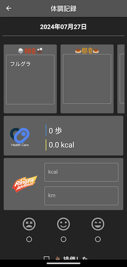

# simple_dyphic
体調管理アプリdyphicの簡易版アプリとして作成しました。  
初めは簡易版で終わらせるつもりでしたが、数年経過してもう少し情報を追加したくなったのでdyphicの簡易版ではなくなっています。  

私しか使わない想定のアプリですのでAndroidアプリ側しか動作確認と利用をしていません。ただ、一応どちらでも使える実装にはなっているはずです。

（Appleのヘルスケアアプリ連携の部分は動くか不明なのと、アイコンをヘルスコネクト固定にしているので分岐が必要です）

# command
```
// build
flutter build apk --release --split-per-abi
flutter build appbundle
```

# screenshot
Android端末でのスクリーンショット  
  
